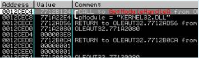
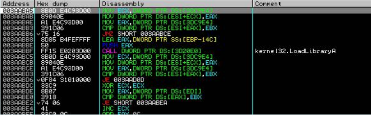
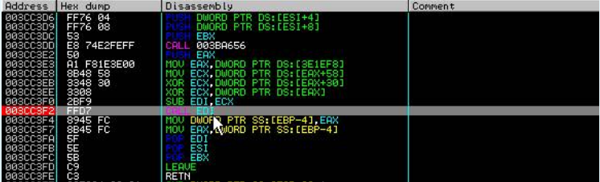

# Armadillo 4.xx-Code Splicing

Nesse tutorial você vai precisar das seguintes ferramentas:

* OllyDBG - Com a melhor configuração para debbug para ArmMUP do hacnho
* LordPE 1.4 Deluxe
* Import REConstructor 1.6 Final
* ArmInline 0.6

Você pode adaptar para a nova geração com as seguintes configurações:

* x96Dbg - Com SharpOD ou qualquer outro Anti-Debug de sua preferência
* Scylla Dump

## **Iniciando o Unpacking**

Carregue o alvo

Avance até o **GetModuleHandleA**, use o shift + F9 chegar até a função e para ignorar as exceções

Pressione novamente shift + F9, por duas vezes

Pressione novamente shift + F9, por três vezes

Enter 4:

Enter 5:

Enter 6:

Enter 7:

Enter 8:

Enter 9:

Tecla F8 para navegar através do opcode RETN, você terá a seguinte visão:

Salto mágico, EB's patch:

Avance até o GetModuleHandle A, defina um breakpoint "BP CreateThread", continue com Shift + F9, Ctrl + F9, F8, Ctrl + F9, F8:

Aperte Down

Esse "CALL EDI", Breakpoint com F2, F9, F7 e Pronto chegamos ao OEP!

Precisamos encontrar sinais de código para fazer uma emenda, use ALT + M:

Vamos ao ArmInline completar as informações como a seguir:

Hehe, Nossa emenda foi um sucesso, vamos encontrar a IAT, No endereço 00401022, se você  seguir no dump você vai encontrar informações da IAT como a seguir:

| IAT | Informação |
| :--- | :--- |
| Inicio da IAT | 004837FC 4000A314 **VCL50. System @ @ initialization $ qqrv** |
| Fim da IAT | 00484FE8 7621F6C6 **WININET.FindNextUrlCacheEntryA** |
| Tamanho da IAT | 000017EC |

Vamos dumpar com o LordPE:

Entre com as seguintes informações no impREC:

| Tipo | Endereço |
| :--- | :--- |
| OEP | 00001000 |
| IATRVA | 000837FC |
| IATSIZE | 000017EC |

Sobre nosso DUMP:

Vamos detectar nosso DUMP usando o PeiD 0.93:

Vamos rodar nosso DUMP:

