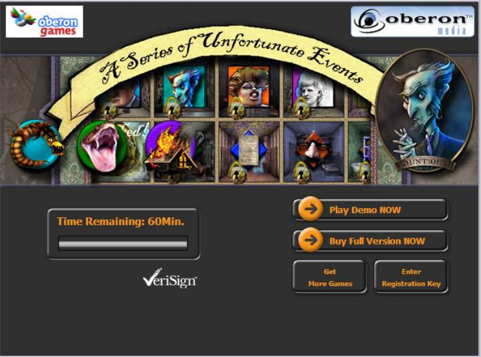
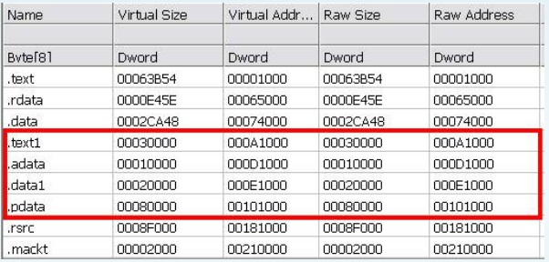

# Armadillo & Macromedia Games \| Proteção e Trial




Nesse tutorial você vai precisar das seguintes ferramentas:

Geração clássica:

* OllyDBG + Plugins para ocultar como o StrongOD
* LordPE
* ImportREC 1.6
* CFF Explorer

Geração nova:

* x96Dbg + SharpOD
* Scylla Dumper

Se você  clicar no botão "Jogar demo agora", esse segundo launcher vai carrgar um arquivo\(ou arquivo principal\) para rodar o jogo. mas você consegue rodar rodar pelo principal. e Claro, ambos os arquivos usam a proteção do Armadillo.

Carregue o arquivo "Unfortunate.exe" dentro do Olly, vamos parar no EP:


A empresa Oberon somente usa o Armadillo como proteção padrão para proteger seus jogos, Nesse artigo não será explanado detalhes sobre esse tipo de proteção de binários porem você consegue encontrar esse tipo de material facilmente com vídeos no youtube ou fóruns de engenharia reversa, pois já é um protector ultrapassado.  
Porem seguindo a recomendação do livro do TEAM-REA, é recomendado um script **"Armadillo V4.0-V4.4.Standard.Protection.osc"**, de acordo com eles essa é a melhor forma de fazer Bypass para iniciantes.

Ok, após rodar o script recomendado você vai parar de caro no OEP:


Certo, vamos abrir o LordPE e dumpar o binário da memória:


Então vamos corrigir a IAT usando o ImportREC:


Vamos reduzir o tamanho do arquivo com o CFF Explorer\(Remover seções inúteis do binário\), e não podemos esquecer de corrigir a "Base" direto pelo CFF Explorer mesmo.




Salve o arquivo, e depois disso tente rodar, você vai se deparar com a seguinte mensagem de erro:


Não fique aflito com esse erro, Nos fizemos um bom Unpack, porem isso é somente uma proteção customizada.

Ok, abre novamente o binário corrigido com o Olly, pare no OEP, e Busque por Strings: \(Atenção: se você esquecer de consertar a "Base do Código", você não conseguira encontrar as Strings no Olly\).


Digite **"VERIFY":**


Vamos atingir o seguinte ponto da imagem:


Pressione Enter, e pare nesse seguinte ponto:


Dê um scroll um pouco para baixo, defina um Breakpoint no início da função, Quando rodar, ele vai parar por alguns momentos, essa função muito provavelmente faz a verificação de algum arquivo,  Ok, vamos dar um scroll algumas vezes e encontrar o seguinte comando:


Se essa função retornar zero em AL, ele mostrará a mensagem de erro:

Função filha atual:

```text
IAT-32
mov AL, BYTE PTR SS:[EBP + 14] ; 0
pop EBX
retn

C
AL = OFFSET_CHK;
return AL;
```

Função pai:

```text
C++
void CHK(Macromedia *macrocontext, LPCTSTR MSG){
   Macromedia *security;
   if(macrocontext->funcao_filha() == 0){
      MessageBox(NULL, L"Critical Initialization Failure", MSG, 0);
      security->VerificarBinarioArquivos();
   }else{
      return;
   }
}
```

Para mudarmos isso basta alterar para que sempre seja retornado o valor 1:


```text
IAT-32
mov AL, 1 ; forçamos sempre retornar o valor 1
NOP       ; Byte nopado para manter o tamanho do binário
POP EBX
RETN

C
AL = 1;
return AL;
```

Bom agora basta salvar esse arquivo, para isso vá até   
Copy to executable -&gt; Select and Save the file

Agora basta executar o jogo e ele ira iniciar sem nenhuma mensagem de erro ou limitação de tempo.

